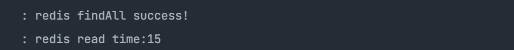

### 기능

---

- 약국 찾기 서비스
  - database 가 약국의 위치정보를 가지고있다.(서울시 공공데이터 활용)
    - 약국의 위치 정보는 시시각각 변하는 정보가 아니기때문에, 오전 4시마다 redis 로 캐싱한다.
  - 주소를 입력하여 요청하면 가까운 약국 3곳을 불러온다.
    - 정확한 주소를 입력 받기 위해 Kakao 우편번호 서비스 사용한다.
  - 입력 받은 주소를 위도, 경도로 변환하여 약국 데이터들 중 가까운 약국을 찾는다
    - 입력받은 주소부터 약국까지 직선 최단 거리를 구하는 공식을 사용한다.
  - 입력한 주소 정보에서 반경 10km 내에 있는 약국만 추천 한다.
  - 추천한 약국 데이터는 길안내 URL 및 로드뷰 URL로 제공한다.

### 메인

### 검색 결과

## Project Structure

---

### 개발환경

- IntelliJ IDEA
- Java 17
- Gradle 7.4.1
- Spring Boot 2.6.7

### 기술스택

- Spring Boot
- Spring Data JPA
- Lombok
- Docker
- Redis
- MariaDB

### System Diagram

---

## 개선 사항

---

### Redis 를 사용하여 api 요청 빈도 낮추기

> 모든 요청마다 Kakao Local api 를 요청한다.
>

카카오 Local api 는 주소로 요청을 보내면 위도, 경도, 지번주소등 값으로 반환합니다.

### 목적

같은 장소에 대한 반복적인 검색을 했을 때, api 호출을 줄여 속도를 향상시킨다.

- 기존: 주소를 입력 받을때마다 항상 api 를 요청한다.
  - api 비용이 비싸질 경우 시스템 운영 비용도 같이 올라가게된다.
- 개선: redis 에 api 결과를 저장하고, 저장된 데이터가 없을때만 요청을 보낸다.
  - redis를 먼저 조회하고, 조회된 데이터가 있다면 위도,경도 값을 반환한다.
  - 조회된 데이터가 없다면 api를 요청하고, 데이터를 redis에 저장한다.

- redis 에 결과값이 있을 경우 api 요청을 하지않기때문에 속도가 눈에띄게 빨라졌다.
  - 289 ms → 15 ms

### 약국을 FullScan 하는 방식에서 분류된 단위로 조회

---

> 약국의 수가 많아지면 조회와 연산시간이 오래걸린다.
>

약국을 시도/구/동 단위로 분류하고, 입력 위치에 해당하는 단위의 약국을 조회하여 계산한다.

### 목적

약국의 거리계산 연산횟수를 줄인다.

- 기존 : 모든 약국을 조회하고, 입력 위치를 기준으로 거리계산을 한다.
  - 약국이 2000개라면 2000번의 연산을 한다.
- 개선 : 지역 단위가 같은 약국을 조회하고, 적거나 없다면 더 넓은 단위를 조회한다.
  - 약국정보를 시도/구/동 으로 분류하는 depth 테이블을 redis에 저장한다.
  - 입력받은 위치의 행정구역 정보를 받아온다.
  - 약국을 좁은 단위부터 계산하여 약국리스트를 만든다.

### depth 정보를 redis 에서 조회한 이유

- RDBMS 를 사용한다면, depth 필드에 인덱스를 걸고 db 에서 조회하는 방법
  - 약국의 정보가 추가되거나 바뀔때, 추가 조작없이 변경 사항이 반영됩니다.
- NoSql(redis) 사용한다면, 약국의 depthName 으로 약국 id 리스트를 가져오는 방법
  - 자주 사용되면서 자주 변경되지 않는 데이터의 경우 캐시를 적용하면 성능향상을 이뤄낼수 있다.
  - 약국정보는 자주 변경되는 정보가 아니므로 정합성문제에서 조금은 자유로울 수 있다.

약국의 위치정보는 최대 하루 1번 최신화되고, 자주 변경되는 데이터가 아니기때문에 캐시를 사용해 빠른 성능 확보를 목적에 두었습니다.

### **redis 용량 줄이기 고도화**

---

> 고도화 할 부분: redis 용량 줄이기
>

**가정) 서비스가 확대되어, redis의 용량을 줄여달라는 요청.**

### **1. redis에 cache miss 했을 때만 데이터 올리기**

- **기존:** 매 오전 4시마다 DB(공공데이터)에서 redis 로 약국 정보를 올릴 때, depth 정보도 같이 올렸다.
- **개선:** cache miss 했을때, DB 에서 필요한 depth 정보를 조회하고 redis에 올린다.

### **2.데이터 압축 알고리즘을 사용해서 용량 줄이기**

- **gzip** 압축 방식을 사용했습니다.
- 압축 전: 980928 - 906648 = 74280
  - **1건당 약 371 byte**

    

- 압축 후: 931648 - 906648 = 25000
  - **1건당 125 byte**

    

- **원본 대비 약 67% 압축**